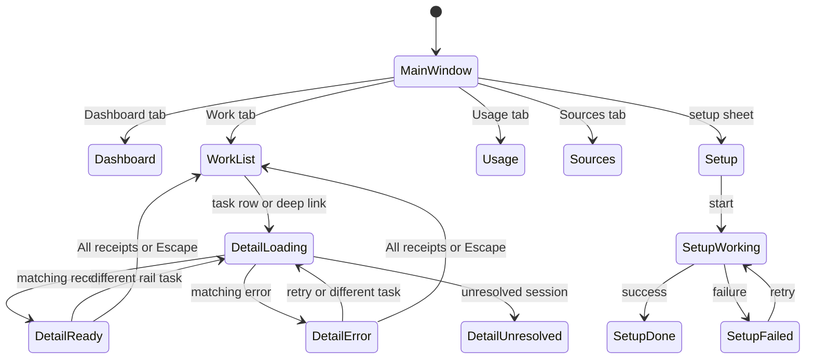

# Calm continuity

## A restrained interaction system for agentacct

**Research date:** 2026-08-28

This is the durable design record for the interaction-motion change: the
decision, evidence, state model, acceptance gates, and honest validation
boundary.

## The decision

The app does not need more animation everywhere. It needs one restrained continuity policy in the few places where state currently teleports.

Keep the fixed top bar, quiet macOS highlights, native controls, and existing zero-bounce selected-tab capsule. Improve five seams:

1. Work table ↔ receipt detail.
2. Receipt A ↔ loading/error ↔ receipt B.
3. Button, pane, content, and reduced-motion token semantics.
4. Disclosures and dense chart changes.
5. Refresh, error, and setup-phase feedback.

The visual language is opacity and very small local movement. No full-window slide, bounce, scale-on-every-button, animated blur, staggered rows, sound, haptics, or new dependency.

This is the smallest coherent answer because the repository already has the right foundation: shared `Motion` tokens, quiet button states, a pane crossfade, matched selection geometry, and generation-guarded receipt fetching.

## Verified root causes

| Priority | Evidence | Diagnosis |
| --- | --- | --- |
| HIGH | `WorkPane.swift` | Work table and split detail were direct same-pane replacements; the existing top-level crossfade never applied. |
| HIGH | `WorkPane.swift`, `DashboardStore.swift` | A new rail selection correctly cleared the old receipt, but left a large blank loading region before content or error appeared. |
| MEDIUM | `Theme.swift` | The old press response read as a flash, and one easing token covered geometry with different perceptual needs. |
| MEDIUM | `StepComponents.swift`, `WorkPane.swift`, `ReceiptsPane.swift` | Disclosure families animated layout without consistently checking Reduce Motion. |
| MEDIUM | `DashboardPane.swift` | One broad transaction could animate as many as 90 bar heights. |
| MEDIUM | `SetupSheet.swift` | Setup directly swapped phases and repeatedly auto-scrolled without a Reduce Motion gate. |
| LOW | `MainWindow.swift`, `MenuContent.swift` | Refresh buttons and spinners replaced each other in place without connective state feedback. |

## Evidence-backed principles

Apple's [Motion Human Interface Guidelines](https://developer.apple.com/design/human-interface-guidelines/motion) say motion should be purposeful, brief, precise, optional, and cancelable; frequent interactions generally should not add motion that makes people wait. Apple's [Buttons guidance](https://developer.apple.com/design/human-interface-guidelines/buttons) says custom buttons always need a press state, and its [Feedback guidance](https://developer.apple.com/design/human-interface-guidelines/feedback) favors clear status near the affected context.

Apple's [Loading guidance](https://developer.apple.com/design/human-interface-guidelines/loading) recommends showing stable content or placeholders rather than a blank, apparently stalled area. Its [Split views guidance](https://developer.apple.com/design/human-interface-guidelines/split-views) emphasizes persistent selection so list and detail stay related.

For accessibility, SwiftUI exposes the system preference through [`accessibilityReduceMotion`](https://developer.apple.com/documentation/swiftui/environmentvalues/accessibilityreducemotion). Apple's [Reduced Motion evaluation criteria](https://developer.apple.com/help/app-store-connect/manage-app-accessibility/reduced-motion-evaluation-criteria) says not to remove meaningful feedback indiscriminately: replace hierarchical movement with dissolves, highlight fades, or color shifts. W3C's [Animation from Interactions](https://www.w3.org/WAI/WCAG22/Understanding/animation-from-interactions.html) corroborates that nonessential interaction-triggered motion must be disableable.

For implementation, SwiftUI's [`ContentTransition`](https://developer.apple.com/documentation/swiftui/contenttransition) fits content changing inside one stable view. Apple's [Explore SwiftUI animation](https://developer.apple.com/videos/play/wwdc2023/10156/) explains how scoped transactions avoid unrelated descendant animation and merge retargeted state; [Animate with springs](https://developer.apple.com/videos/play/wwdc2023/10158/) supports perceptual-duration springs. [Designing Fluid Interfaces](https://developer.apple.com/videos/play/wwdc2018/803/) supplies the governing idea: feedback should be immediate, continuous, and redirectable.

Apple does not prescribe macOS pane-transition timing. The values below are testable starting hypotheses derived from the app's current 70–220 ms language and a production motion-audit budget—not platform mandates.

## The state machine

Every implementation must preserve these invariants:

- Latest input wins; animation never queues or locks input.
- Selected pane, selected rail row, fetch key, placeholder identity, and displayed receipt converge on the same destination.
- Old receipt content is never relabeled as a new selection.
- Fixed chrome and unaffected columns do not move.
- Loading/error stays local and preserves a route back.
- Reduce Motion removes position, scale, bounce, depth, and auto-scroll; brief opacity/color feedback remains.
- High-frequency filter/sort changes are immediate, with no row choreography.

## The exact starting grammar

| Interaction | Normal motion | Reduce Motion | Reason |
| --- | --- | --- | --- |
| Button press | 100 ms ease-out, color/opacity | Same | Perceptible immediate acknowledgement; desktop restraint. |
| Hover/focus | 100 ms ease-out color; focus ring immediate | Same | Target location, not decoration. |
| Peer pane | 180 ms ease-out opacity | 120 ms opacity | Prevent a flash while keeping top-level sections equal. |
| Persistent selection | 220 ms zero-bounce spring | Instant geometry plus color/opacity | Connect selection without playful bounce. |
| Work list → detail | 200 ms ease-out opacity plus at most 12 pt horizontal offset | 120 ms opacity only | Explain hierarchy locally. |
| Receipt phase/result | 160 ms ease-out opacity in a stable detail frame | 120 ms opacity | Preserve context and truth during latency. |
| Disclosure/chart geometry | 180 ms ease-in-out, scoped; only up to 30 chart buckets | Instant geometry; optional 120 ms opacity | Smooth bounded morphing without dense reflow. |
| Setup/status phase | 160–180 ms ease-out opacity | 120 ms opacity | Calm consequential feedback without celebration effects. |

## The 200-person role play

The [scenario matrix](scenario-matrix.csv) contains exactly 200 unique simulated individuals: 20 input/accessibility/context archetypes crossed with 10 state journeys. Every row has a start state, event, current risk, normal target, Reduce Motion target, interrupt probe, and acceptance gate.

| Iteration | PASS | RISK | FAIL |
| --- | ---: | ---: | ---: |
| Current code heuristic | 71 | 41 | 88 |
| Navigation-continuity pass | 154 | 38 | 8 |
| Complete target policy | 200 | 0 | 0 |

The baseline failures clustered in Work list/detail, record switching, Back,
Dashboard deep links, chart coherence, and Reduce Motion. The implemented
policy resolves them through atomic navigation, latest-input-wins behavior,
stable loading, reduced-motion alternatives, scoped geometry, and async
feedback.

“200/200 pass” means every simulated state path satisfies its written gates after the proposed rules. It does not mean 200 real people prefer the design or that everyone is literally happy.

## What not to build

- No universal 0.97 scale press effect; it is too touch-like for this dense macOS dashboard.
- No removal of the selected-tab matched geometry; it is one useful, no-bounce continuity cue.
- No animation on Work filtering, sorting, search results, or every row hover.
- No old receipt left visible beneath a new task title.
- No new router, `NavigationStack`, motion package, haptics, sound, blur, or glass redesign.
- No change to the settled rule that selecting the Work top tab returns to the receipts table.

## Implemented scope

- One exact timing and normal/reduced motion vocabulary.
- Reversible, interruptible Work navigation with preserved list context.
- Truthful loading and error shells where the latest receipt wins.
- Reduced-motion-safe disclosures and bounded dense chart animation.
- Immediate refresh feedback and calm setup/status phase changes.

The change adds no dependency or new navigation framework.

## Acceptance

Automated checks must cover Work state derivation, A → B → C cancellation, stale success/error rejection, unresolved sessions, Back/Escape, setup phases, delayed refresh visibility, and chart/disclosure policy. Endpoint snapshots cover light/dark, minimum/reference width, large text, list/loading/ready/error/unresolved, setup phases, 7/30/90 buckets, and dense content. Snapshots do not validate motion.

The real-window gate is mandatory:

1. Record every priority path at normal speed and 0.25x.
2. Repeat with macOS Reduce Motion enabled.
3. Spam tabs, rows, rail, Back/Escape, chart measures, disclosures, and refresh.
4. Verify 960×560, reference width, 5K wide, dark mode, 200 receipts, 90 bars, an 800 ms fetch, offline failure, keyboard-only use, and VoiceOver.
5. Reject any stale destination, queue, double exposure, clipped endpoint, focus loss, locked input, or frame hitch.

Before calling the result comfortable or delightful, observe at least one representative first-day user, daily expert, keyboard-only user, VoiceOver user, Reduce Motion user, slow-machine user, dense-store reviewer, and failed-check reviewer completing the five priority journeys. That human gate is the empirical follow-up to the simulated corpus.

## Limitations

- The 200 scenarios are simulated requirements, not results from 200 real people.
- Static images cannot validate overlap, interruptibility, latency, or comfort.
- Exact timing remains a design hypothesis until representative humans exercise the actual build.
