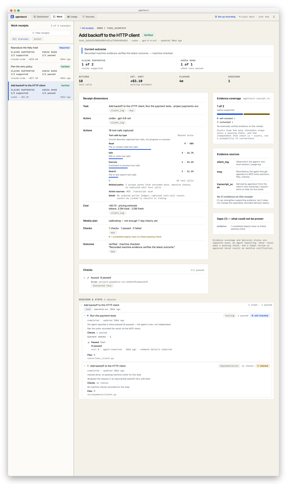

# Compare Claude Code and Codex by task outcome, evidence and cost

<!-- GENERATED by scripts/gen_worked_examples.py — do not edit by hand. -->

> The data below is a synthetic demo workspace — invented projects and pricing-table cost **estimates**, never billed figures. Every number, evidence tier, provenance label and gap is the real receipt engine's own output; only the underlying work is invented.

The same task — **"Add retry-with-backoff to the payments HTTP client"**, from the same starting commit — was run once on Claude Code and once on Codex. agentacct turns each into one Work Receipt. Read them side by side: not by whose summary sounds more confident, but by what actually happened, how well it is proven, and what it cost.

## Claude Code

### Work Receipt — Add retry-with-backoff to the payments HTTP client

`task_cc_retry`

- **Verified — 1/2 self-checked**
  Not yet proven: 1 completed step unchecked
  Counts since May 28

- **Decision — Verified** · asserted by a machine check
  Recorded machine evidence verifies the latest outcome.
  Outcome (agent-reported): Implemented the backoff wrapper; the 8 tests pass.
- **Coverage — 1/2 self-checked · 1 unchecked**
  1 not check-relevant
  Not check-relevant: review, research, planning, docs
  Counts are passing checks over checkable steps, split by how independent each check is. These are counts, not a probability of correctness.

> Evidence coverage and decision status are separate axes: an agent reporting 'done' never adds a passing check, and a human review or approval never counts as machine verification.

| Dimension | Summary | Source |
| --- | --- | --- |
| Task | Plan the retry policy; Write the retry tests · project payments-svc | Client log, Agent-reported |
| Agents | claude-code · claude-opus-4-8 | Client log |
| Tool calls | 26 tool calls captured · edit×5 execute×6 read×12 search×3 · 2 related paths · ran 2 commands | Hook-captured, Agent-reported |
| Cost | ≈$27.40 · pricing estimate | Client log |
| Weekly plan | calibrating — not enough 7-day history yet |  |
| Checks | 1/1 passed | Agent-reported |
| Decision | Verified · asserted by a machine check | Agent-reported |

**What ran**

- **Tools:** `Read`×12, `Bash`×6, `Edit`×5, `Grep`×3
- **Files touched:** `src/payments/client.py`, `tests/test_client.py`
- **Commands run:** `pytest tests/test_client.py -q`, `ruff check src/`

**Gaps (4)** — what could not be proven

- **Tool calls** — Tool-call capture did not cover this Task: captured 26 calls covering May 28 20:37 of a May 28 20:26–20:34 task · the ledger holds 3 recorded sections but capture saw no record_section call · the ledger holds 1 recorded check but capture saw no record_machine_check call.
- **Checks** — 1 completed step has no linked passing check.
- **Checks** — No commit was recorded with this work, so it cannot be located in the repository.
- **Tool calls** — File operations were not ordered, so the recorded paths cannot be read as a sequence of edits.

**Provenance**

- **Client log** — Observed in the agent's own local session / usage log.
- **Hook-captured** — Captured by an agentacct client hook (tool categories, mechanical checks).
- **Agent-reported** — Recorded by the agent through agentacct's MCP tools (sections, files, checks).

## Codex

### Work Receipt — Add retry-with-backoff to the payments HTTP client

`task_cx_retry`

- **Verified — 1/2 self-checked**
  Not yet proven: 1 completed step unchecked
  Counts since May 28

- **Decision — Verified** · asserted by a machine check
  Recorded machine evidence verifies the latest outcome.
  Outcome (agent-reported): Ran the suite; recorded the result via the MCP check.
- **Coverage — 1/2 self-checked · 1 unchecked**
  Counts are passing checks over checkable steps, split by how independent each check is. These are counts, not a probability of correctness.

> Evidence coverage and decision status are separate axes: an agent reporting 'done' never adds a passing check, and a human review or approval never counts as machine verification.

| Dimension | Summary | Source |
| --- | --- | --- |
| Task | Add backoff to the HTTP client; Run the payment tests · project payments-svc | Client log, Agent-reported |
| Agents | codex · gpt-5.6-sol | Client log |
| Tool calls | 18 tool calls captured · edit×3 execute×4 read×9 search×2 · 2 related paths · ran 1 command | Agent-reported, Transcript scan |
| Cost | ≈$3.10 · pricing estimate | Client log |
| Weekly plan | calibrating — not enough 7-day history yet |  |
| Checks | 1/1 passed | Agent-reported |
| Decision | Verified · asserted by a machine check | Agent-reported |

**What ran**

- **Tools:** `read_file`×9, `exec_command`×4, `apply_patch`×3, `grep`×2
- **Files touched:** `src/payments/client.py`, `tests/test_client.py`
- **Commands run:** `pytest tests/test_client.py -q`

**Gaps (4)** — what could not be proven

- **Tool calls** — Tool-call capture did not cover this Task: captured 18 calls covering May 28 20:34 of a May 28 20:26–20:31 task · the ledger holds 2 recorded sections but capture saw no record_section call · the ledger holds 1 recorded check but capture saw no record_machine_check call.
- **Checks** — 1 completed step has no linked passing check.
- **Checks** — No commit was recorded with this work, so it cannot be located in the repository.
- **Tool calls** — File operations were not ordered, so the recorded paths cannot be read as a sequence of edits.

**Provenance**

- **Client log** — Observed in the agent's own local session / usage log.
- **Agent-reported** — Recorded by the agent through agentacct's MCP tools (sections, files, checks).
- **Transcript scan** — Derived by agentacct from the client's own transcript / session store on disk (no live hook).

## Reading the difference

Both agents finished the task, both recorded a passing test, and both receipts read **verified** with **self-checked** evidence — the receipt gives neither a stronger badge than it earned. What differs is *how the work was observed* and *what it cost*:

| | Claude Code | Codex |
| --- | --- | --- |
| Actions provenance | `hook` — a live client hook observed the tool categories | `transcript_scan` — read back from Codex's own on-disk session store (no hook fires) |
| Evidence tier | self-checked (agent-recorded via MCP) | self-checked (agent-recorded via MCP) |
| Cost (estimate) | $27.40 — an Opus-class model | $3.10 — a smaller model |

Both checks are **self-checked**: the agent recorded the passing run itself. To raise a check to *independently-checked*, a client hook (or CI) has to observe it — the [coverage matrix](../coverage-matrix.md) shows which agents support that. The point of the receipt is that it says *self-checked* here, instead of painting an agent-recorded pass the same green as an independently-verified one.

Note the two axes staying separate: the decision reads **verified** because the latest check passes and postdates the newest work, while the evidence coverage (1/2) shows not every step is individually checked. A clean decision word never hides partial coverage.

**What this does not tell you (the honest unknowns):**

- The costs are pricing-table estimates, not provider invoices.
- Self-checked does not mean wrong — it means no independent check observed the run.
- Neither receipt judges code quality or whether the retry design is right; they record what ran, what passed, and what it cost.

See also [When an agent says done](when-an-agent-says-done.md) for how the timeline exposes a re-run and an outdated check, and the [coverage matrix](../coverage-matrix.md) for what each agent's lanes can and cannot prove.
